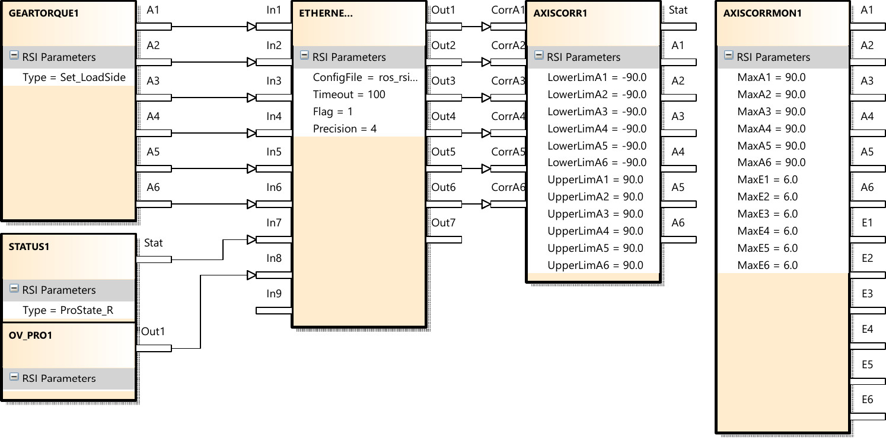
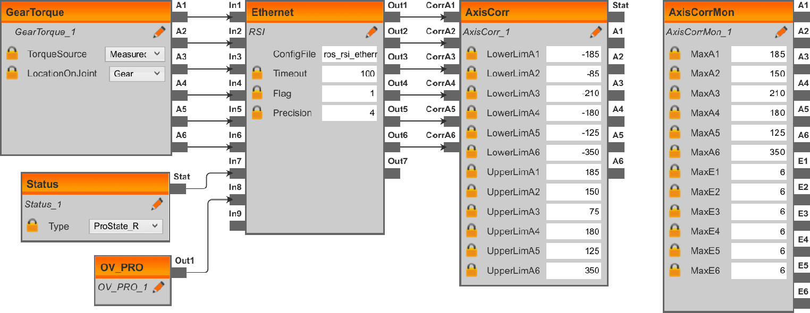

.. _setup:

Setting up the Robot
====================

Some robot configuration on the robot is required to set up RSI. While this page explains how to set up necessary configuration files, we recommend taking a look at:

* `kuka_experimental <https://github.com/ros-industrial/kuka_experimental/tree/melodic-devel/kuka_rsi_hw_interface/krl>`_ has excellent documentation on robot setup.
* The *KUKA.RobotSensorInterface - Operating and programming instructions* manual for comprehensive guidance.

Network Configuration
---------------------

A new network interface needs to be created on the teach pendant under ``Start-up`` > ``Network Configuration`` > ``Advanced``. Name the network "``RSI``" and set the IP address to a new address in the local network of your control PC.

**ToDo**: Detailed description for C4 and C5 Controllers

RSI Configuration
-----------------

A set of configuration files need to be installed on the robot. This can either be done using a USB drive or by deploying them from a WorkVisual project.

For all controllers
^^^^^^^^^^^^^^^^^^^

* ``krl/Common/ros_rsi_ethernet.xml`` -> ``C:\KRC\ROBOTER\Config\User\Common\SensorInterface\ros_rsi_ethernet.xml``

  This file defines the network communication and needs to be adjusted by hand to fit your network setup. In particular:

  * The ``ROOT`` > ``CONFIG`` > ``IP_NUMBER`` element needs to match the IP address of your control PC. It needs to match the ``listen_address`` parameter to the hardware interface.
  * The ``ROOT`` > ``CONFIG`` > ``PORT`` element can be adjusted. It needs to match the ``listen_port`` parameter to the hardware interface.

For KR C4 controllers
^^^^^^^^^^^^^^^^^^^^^

* ``krl/KR_C4/ros_rsi.rsi`` -> ``C:\KRC\ROBOTER\Config\User\Common\SensorInterface\ros_rsi.rsi``

  ``krl/KR_C4/ros_rsi.rsi.diagram`` -> ``C:\KRC\ROBOTER\Config\User\Common\SensorInterface\ros_rsi.rsi.diagram``

  These files should not be edited by hand.

* ``krl/KR_C4/ros_rsi.rsi.xml`` -> ``C:\KRC\ROBOTER\Config\User\Common\SensorInterface\ros_rsi.rsi.xml``

  The ``AXISCORR`` and ``AXISCORRMON`` object parameters can be adjusted to contain application-specific joint limits.

These files define the following RSI setup:

For KR C5 controllers
^^^^^^^^^^^^^^^^^^^^^

* ``krl/KR_C4/ros_rsi.rsix`` -> ``C:\KRC\ROBOTER\Config\User\Common\SensorInterface\ros_rsi.rsix``

  This file should not be edited by hand.

This file defines the following RSI setup:

Robot Program
-------------

In order to use the stored RSI context, a program file is provided in ``krl/KR_C[4,5]/kuka_rsi_driver.src``. It needs to be stored at ``KRC:\R1\Program\kuka_rsi_driver.src``.

You can adjust the initial robot position in the Program.

When started, this file:

1. Moves to an initial configuration.

2. Loads the RSI context, turns it on and performs RSI-based motion.

3. Moves back to the initial configuration.
